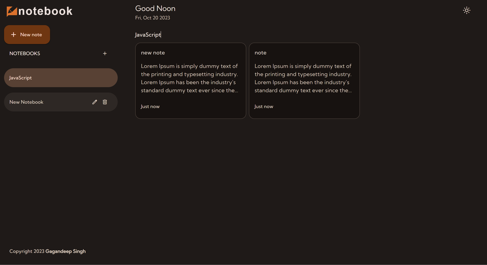
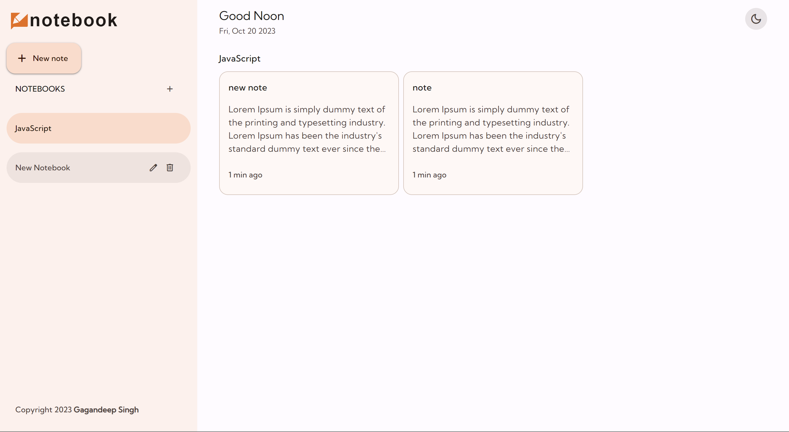

# notebook
Note taking app using javascript

<h4>For beter expierence: use "Chrome" browser.</h4>

</img>
</img>

## Tech Stack
**Technology:** HTML, CSS, JavaScript

<h3>🛠️ Installation Steps:</h3>

<p>1. Clone the repository</p>

```
git clone https://github.com/imgagandeep/notebook.git
```

<p>2. Start the development server</p>

```
click on "Go Live"
```

<p>3. Access the application at</p>

```
http://localhost:5500
```
